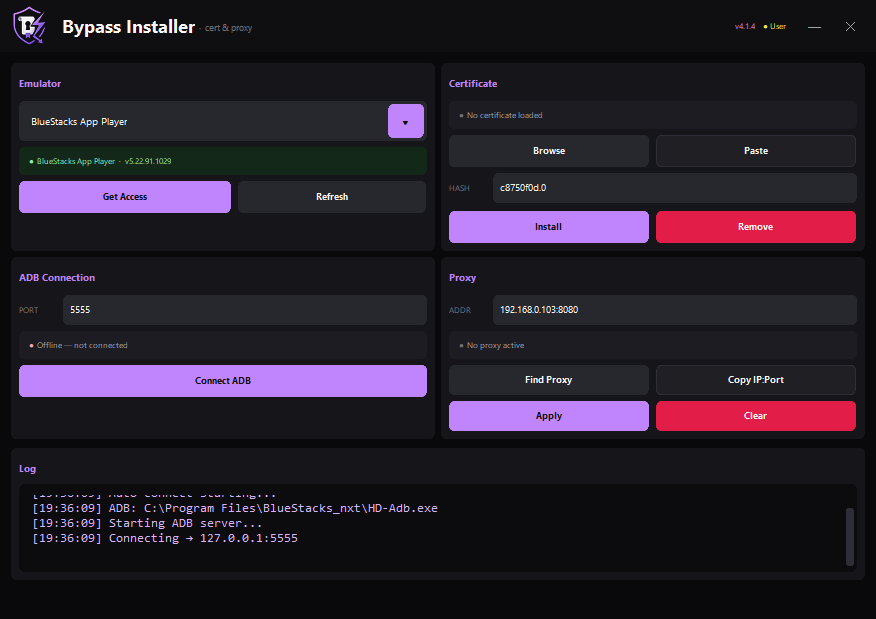

<p align="center">
  
</p>

<h1 align="center">Bypass Installer v4.1.2</h1>

<p align="center">
  Certificate injection &amp; proxy tool for Android emulators<br>
  <strong>BlueStacks 5</strong> · <strong>BlueStacks China</strong> · <strong>MSI App Player 5</strong>
</p>

<p align="center">
  <a href="https://github.com/a-info/Bypass-Installer-Python/releases/tag/v4.1.2">
    
  </a>
  
  
  
</p>

---

## Preview

<p align="center">
  
</p>

<p align="center"><em>Obsidian Violet theme · custom title bar · compact 2×2 layout</em></p>

---

## Overview

**Bypass Installer** is a Windows desktop tool for injecting CA certificates into Android emulator system stores and managing HTTP proxies. Built with **CustomTkinter**, it provides a dark, modern UI with step-by-step logging for ADB operations.

| | |
|---|---|
| **Version** | 4.1.2 |
| **Author** | [a-info](https://github.com/a-info) |
| **Email** | who.is.a.dev@hotmail.com |
| **Repo** | [github.com/a-info/Bypass-Installer-Python](https://github.com/a-info/Bypass-Installer-Python) |

---

## Features

### Certificate management
- Browse `.pem`, `.cer`, `.crt`, or `.0` certificate files
- **Paste cert** from clipboard (PEM text, base64, or file path)
- Custom hash field (default: `c8750f0d.0`) or auto-compute via OpenSSL
- Inject into `/system/etc/security/cacerts/{hash}.0`
- Remove installed certificates with one click

### Emulator support
- **BlueStacks App Player** (BlueStacks 5 / `BlueStacks_nxt`)
- **BlueStacks China** (`BlueStacks_nxt_cn`)
- **MSI App Player 5** (`BlueStacks_msi5`)
- Auto-detect install path, version, and ADB port from registry & config
- **Get Access** — enables R/W on system partitions (bypass readonly VHD)

### ADB & connection
- Resolves `HD-Adb.exe` from emulator install or PATH
- Connect / disconnect with detailed colored logs
- Auto-connect on startup
- Connection health polling every 3 seconds

### Proxy
- **Find Proxy** — auto-detect local IPv4 and fill `IP:port` (default port `8080`)
- **Copy IP:Port** — copy active or device proxy address to clipboard
- Status chip shows connected proxy (`Connected · 192.168.x.x:8080`)
- Apply system-wide HTTP proxy (`settings put global http_proxy`)
- Clear proxy settings
- Reads proxy from device when ADB is linked

### UI & Windows integration
- **Obsidian Violet** dark theme
- Custom frameless window (native taskbar button)
- Transparent app icon (no black box on taskbar)
- Auto **Administrator** elevation via UAC manifest
- Opens centered and in front after UAC

---

## Download (EXE)

> **Recommended:** Download the pre-built executable from GitHub Releases.

| File | Description |
|------|-------------|
| [`Bypass-Installer-v4.1.2.exe`](https://github.com/a-info/Bypass-Installer-Python/releases/download/v4.1.2/Bypass-Installer-v4.1.2.exe) | Portable single-file app (~20 MB) |

### EXE details

| Property | Value |
|----------|-------|
| **Name** | Bypass Installer |
| **Version** | 4.1.2 |
| **Size** | ~21 MB |
| **Architecture** | Windows 64-bit |
| **Admin required** | Yes (UAC prompt on launch) |
| **Console** | Hidden (GUI only) |
| **Icon** | Purple shield — transparent background |
| **Bundled assets** | `logo.ico`, `logo.png`, `LICENSE.txt`, CustomTkinter themes |
| **Cache folder** | `.cert_cache/` next to the exe (pasted certificates) |

### How to run the EXE

1. Download `Bypass-Installer-v4.1.2.exe` from [Releases v4.1.2](https://github.com/a-info/Bypass-Installer-Python/releases/tag/v4.1.2)
2. Double-click the file
3. Click **Yes** on the UAC Administrator prompt
4. The app opens centered with a taskbar icon

---

## Quick start

```
1. Select emulator     →  BlueStacks / MSI from dropdown
2. Get Access          →  Launches emulator + enables system R/W
3. Connect ADB         →  Links to 127.0.0.1:{port}
4. Browse / Paste cert →  Pick or paste your CA certificate
5. Install             →  Injects {hash}.0 into system store
6. Find Proxy / Apply  →  Auto-fill IP:port, apply to emulator
```

### Certificate formats

| Input | Result |
|-------|--------|
| `mitmproxy-ca-cert.cer` | Auto-hash → `{hash}.0` |
| PEM pasted from clipboard | Saved to `.cert_cache/` |
| File named `c8750f0d.0` | Uses hash from filename |
| Custom hash field | Overrides auto-detection |

---

## Project structure

```
Bypass-Installer-Python/
│
├── cert_installer_python.py    # Main application (UI + CertificateManager)
├── requirements.txt            # Python dependencies
├── bypass_installer.manifest   # UAC admin elevation manifest
├── LICENSE.txt                 # MIT license
├── README.md                   # This file
├── .gitignore                  # Ignores build/, dist/, __pycache__/
│
├── logo.ico                    # App & taskbar icon (multi-size, transparent)
├── logo.png                    # Header logo & bundled asset (256×256 RGBA)
│
├── docs/
│   └── assets/
│       ├── logo.png            # README logo
│       └── app-screenshot.png  # UI preview screenshot
│
├── Bypass Installer.spec       # PyInstaller spec (local build, gitignored)
│
├── build/                      # PyInstaller build cache (gitignored)
├── dist/                       # Compiled exe output (gitignored)
│   └── Bypass Installer.exe
│
└── .cert_cache/                # Runtime cache for pasted certs (created at run)
```

### Source code layout (`cert_installer_python.py`)

| Section | Description |
|---------|-------------|
| **Theme constants** | Obsidian Violet colors, fonts, spacing |
| **Helpers** | `ensure_admin`, `bring_window_to_front`, `apply_native_frameless` |
| **CertificateManager** | ADB, cert install/remove, proxy, emulator bypass |
| **UI widgets** | `GlowButton`, `SectionCard`, `StyledDropdown`, `InfoChip` |
| **App (CTk)** | Main window, 2×2 grid, log panel, event handlers |
| **Build instructions** | PyInstaller command (bottom of file) |

---

## Requirements

### For EXE (end users)
- Windows 10 / 11 (64-bit)
- Administrator privileges
- BlueStacks 5, BlueStacks China, or MSI App Player 5

### For Python (developers)
- Python 3.10+
- OpenSSL in PATH (optional, for cert hash calculation)

```txt
customtkinter
cryptography
pyinstaller
Pillow
```

---

## Build from source

### 1. Clone & install

```bash
git clone git@github.com:a-info/Bypass-Installer-Python.git
cd Bypass-Installer-Python
pip install -r requirements.txt
```

### 2. Run from Python

```bash
python cert_installer_python.py
```

> Requires Administrator. The app will re-launch with UAC if not elevated.

### 3. Build EXE with PyInstaller

```powershell
python -m PyInstaller "Bypass Installer.spec"
```

Or full command:

```powershell
python -m PyInstaller ^
  --onefile ^
  --noconsole ^
  --name "Bypass Installer" ^
  --icon logo.ico ^
  --manifest bypass_installer.manifest ^
  --collect-all customtkinter ^
  --add-data "logo.ico;." ^
  --add-data "logo.png;." ^
  --add-data "LICENSE.txt;." ^
  cert_installer_python.py
```

**Output:** `dist\Bypass Installer.exe`

The spec file includes `uac_admin=True` so the exe requests Administrator on launch.

---

## UI sections

| Card | Controls |
|------|----------|
| **Emulator** | Dropdown, status chip, ADB port, Get Access, Refresh |
| **Certificate** | Hash field, file path, Browse, Paste, Install, Remove |
| **ADB Connection** | Status chip (Connected/Offline), Connect / Disconnect |
| **Proxy** | Address field, Find Proxy, Copy IP:Port, status chip, Apply, Clear |
| **Log** | Timestamped colored output (success / error / warning) |

---

## Troubleshooting

| Problem | Solution |
|---------|----------|
| ADB not found | Open emulator first, click **Get Access**, then **Connect ADB** |
| Connection refused | Check ADB port matches `bluestacks.conf` (`bst.instance.Pie64.adb_port`) |
| Injection failed | Run **Get Access** again, ensure emulator fully booted |
| No taskbar icon | Use v4.0+ (native frameless window fix) |
| App opens behind other windows | v4.0 brings window to front after UAC |
| Cert hash wrong | Set custom hash manually or install OpenSSL |

---

## Release history

| Version | Highlights |
|---------|------------|
| **v4.1.2** | EXE auto-admin UAC fix, frozen build button click fix, uac_admin manifest |
| **v4.1.1** | ADB connect fix, proxy Apply/Find/Copy fixes |
| **v4.1** | Find Proxy button, copy IP:port, connected proxy status chip |
| **v4.0** | Admin UAC fix, taskbar icon, transparent logo, ADB logging, Obsidian UI |
| v3.0 | Previous release |
| v2.0 | Earlier build |
| v1.0 | Initial release |

[All releases →](https://github.com/a-info/Bypass-Installer-Python/releases)

---

## Disclaimer

This tool is for **educational and testing purposes only**. Modifying emulator system partitions can cause instability. Use at your own risk. Always back up important data.

---

## License

MIT License — see [LICENSE.txt](LICENSE.txt)

---

<p align="center">
  Created by <a href="https://github.com/a-info">a-info</a> · Bypass Installer v4.1.2
</p>
